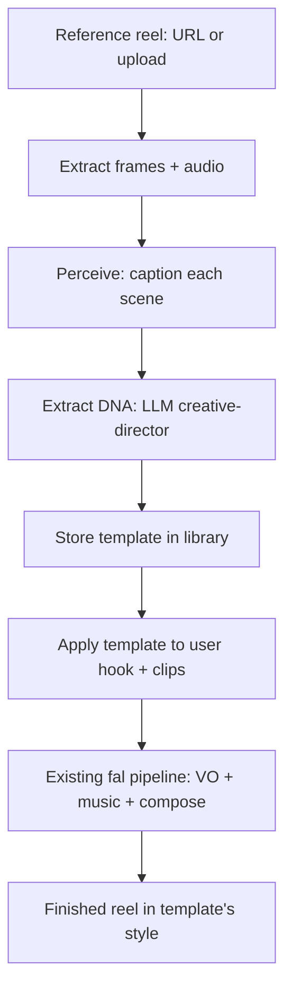

# Pulling Viral Instagram Templates into Reel Studio

**Discussion & proposal** — grounded in *"Stop saying I'm gatekeeping — here's the whole AI editing system"* (simply forseth) + reel_studio's current fal pipeline.

---

## 1. TL;DR

The video's transferable lesson is not "use After Effects." It's a three-step loop:

1. **Steal the *style*, not the content.** Find a reel/edit whose *structure* works, and extract its reusable pattern.
2. **Codify that pattern as a "template / DNA."** Turn "what makes this edit feel viral" into a machine-readable spec.
3. **Mass-produce.** Apply the template to your own hooks/footage, so the *creative* is done once and reused forever.

For reel_studio this means a **new "template ingestion" stage**: pull a viral Instagram reel → extract its *structural DNA* (hook shape, pacing, text treatment, transitions, music mood, grade) → store it as a parameterized template → drive the existing fal voiceover/music/compose pipeline with it.

The critical reframe throughout: **you are reverse-engineering the *pattern*, not ripping the asset.** More on the legal line in §8.

---

## 2. What the video actually teaches (distilled)

The video is a walkthrough of a Claude Code–driven motion-graphics pipeline. The parts that matter for us:

| Video concept | What it maps to in reel_studio |
|---|---|
| "Content OS" — a library of **proven styles / experimental styles / secret sauce** | A **template library** with proven vs. experimental buckets |
| "Go to YouTube → find a tutorial → copy the link → paste into Claude → *recreate this exact style and turn it into DNA*" | **Template ingestion**: input a reel → output a reusable spec |
| "Claude Code is **not creative**. Someone has to give it the creative parts." | The LLM doesn't invent the style — a human picks the viral source; the model *extracts and reproduces* |
| "Create the style **once**, turn it into a **template**, then **batch-record 60 videos** and apply the same style" | Template = write-once, apply-to-many; this is the product's core loop |
| Iterate with **screenshots + plain-language notes** ("I'm pressing at 12s, move it down") | Human-in-the-loop review of template output, versioned |
| **No generative AI** for the visuals — shape-by-shape motion graphics | The *content* is generated (fal), but the *style* is deterministic, parameterized — not a vague prompt |

His exact loop, restated generically:

```
Human finds viral style  →  paste reference  →  model extracts "DNA"
   →  model reproduces the style  →  human flags deltas (screenshots + notes)
   →  model fixes  →  save as template  →  apply to every future edit
```

That loop is directly transplantable to reel_studio. The only difference is the *reference source* (Instagram Reels instead of YouTube tutorials) and the *render target* (fal ffmpeg compose instead of After Effects/Resolve).

---

## 3. What "a template" actually is (and is not)

This is the single most important scoping decision.

**A viral template is structural DNA, not the content.** Extracting a template means capturing:

- **Hook shape** — first 0–3s: text-on-screen phrasing, on-camera action, question vs. statement vs. brag.
- **Pacing** — how many cuts, where the beat-sync lands, scene durations, "payoff" placement.
- **Text / typography treatment** — the *class* of animation (Dan Koe deep-glow minimalism, Apple-style clean motion, 3D text, liquid glass, paper tear) — never the actual text, which is content-specific.
- **Transitions** — cut vs. whip vs. zoom vs. match-cut, and where each is used.
- **Audio** — music mood/genre + BPM, voiceover tone, where music ducks under voice.
- **Grade** — color-grading description (LUT vibe), contrast, film look.

**What you must NOT extract:** the creator's footage, their voice, their likeness, their subject, their literal captions/script, their music track. Those are the *content* you'll replace with your user's hook + photo/clips.

So "pull viral templates from Instagram" = **"ingest a reference reel, and emit a normalized template spec (JSON) describing its structure and style."** Not "download the mp4 and reuse it."

---

## 4. Accessing Instagram reels (reality check — I just hit this exact wall on YouTube)

Be honest about the access problem, because Instagram is *at least* as locked down as YouTube (where I spent real effort getting blocked by bot-detection on this box).

Ways to get a reference reel, in order of reliability:

| Channel | Viability | Notes |
|---|---|---|
| **Manual export / screen-record** by the user | ✅ Reliable | User saves/screens a reel they want to mimic, uploads it to reel_studio. No API needed. |
| **Instagram Graph API** (own/creator/business account) | ⚠️ Limited | Only your *own* media + accounts you're authorized on. Good for a creator's own library, useless for "any viral reel." |
| **Third-party scrapers** (Apify/Instaloader/etc.) | ⚠️ Flaky | Same bot-wall + ToS risk. Fine for a demo, not a product pillar. |
| **Curated template library** (human-curated) | ✅ Product-friendly | You ship with N pre-extracted templates (extracted once, legally as *patterns*), users pick from them — no live scraping at runtime. |

**Recommendation:** make the MVP *upload-based* (user drops a reel they want to extract), and ship a **pre-curated template library** as the default. Live "scrape any Instagram URL" is a demo flourish, not a product foundation — same conclusion as the YouTube transcript exercise.

---

## 5. Template-ingestion pipeline (mapped to fal)

Mirror the existing multi-clip pipeline's shape. New stage highlighted.



| # | Stage | Source | Notes |
|---|---|---|---|
| 1 | **Ingest** | upload/URL | ffprobe to sample frames at intervals + pull audio; detect shot boundaries (`PySceneDetect`, same as Phase 2) |
| 2 | **Perceive** | `fal-ai/florence-2-large` (already in stack) | one caption + tag set per shot: on-screen text, action, camera move, transition, mood |
| 3 | **Extract DNA** | LLM (Gemini via OpenRouter, already in stack) | prompt = *"here are captioned scenes of a viral reel; output a Template DNA JSON describing its structure/style, not its content"* — this is the "creative director" skill |
| 4 | **Store** | in-memory / JSON (hackathon scope) | template library with `proven` vs `experimental` buckets — the "Content OS" analog |
| 5 | **Apply** | existing fal stages | map template fields → voiceover (elevenlabs), music (cassetteai), composition (ffmpeg) |

The extractor (§3) is the *only genuinely new* piece. Everything else reuses what reel_studio already has.

---

## 6. Template DNA schema (concrete)

The creative-director LLM should emit something like this — a normalized, content-agnostic spec:

```jsonc
{
  "meta": {
    "name": "Dan Koe deep-glow minimalist",
    "source_url": "https://instagram.com/reel/...",   // for provenance, not content
    "creator_handle": "@forseth.ai",
    "bucket": "experimental",
    "aspect": "9:16"
  },
  "hook": {
    "seconds": 3,
    "pattern": "question",                 // question | statement | brag | curiosity-gap
    "text_style": "deep_glow_minimalist",  // from a fixed style taxonomy
    "text_on_screen": true
  },
  "scenes": [
    {
      "index": 0,
      "beat": "hook",                       // hook | setup | payoff | cta
      "duration_s": 2.4,
      "text_overlay_class": "deep_glow_minimalist",
      "transition_out": "cut",
      "on_screen_action": "subject speaks directly to camera",
      "beat_sync": true
    }
  ],
  "typography": {
    "font_vibe": "bold_serif_condensed",
    "animation_class": "deep_glow"          // deep_glow | apple_clean | text_3d | liquid_glass | paper_tear
  },
  "audio": {
    "music_mood": "warm_motivational",
    "bpm_hint": 120,
    "voiceover_tone": "calm_confident",
    "duck_under_voice": true
  },
  "grade": {
    "description": "high-contrast, warm, subtle film grain",
    "lut_vibe": "kodak_warm"
  },
  "pacing": {
    "cuts_per_scene": 1,
    "avg_scene_s": 2.4,
    "hard_beat_sync": true
  }
}
```

This schema is deliberately **content-agnostic** — it describes *how* the reel is built, never *what* it says. That's what keeps it on the right side of §8 and reusable across users.

---

## 7. What maps to fal vs. what doesn't (same split as Phase 2)

| Capability | Source | Note |
|---|---|---|
| Scene captioning (perceive) | `fal-ai/florence-2` | already in the multi-clip stack |
| Shot/cut + beat detection | local (`PySceneDetect` + `librosa`) | non-generative; same as Phase 2 |
| **Template DNA extraction** | LLM (Gemini) | the creative-director step; one prompt per reference |
| Voiceover | `fal-ai/elevenlabs` | driven by template's `audio.voiceover_tone` |
| Music | `cassetteai/music-generator` | driven by `audio.music_mood` + `bpm_hint` |
| Composition | `fal-ai/ffmpeg-api/compose` | driven by `scenes[]` + `pacing` + `typography` |

Net: **one new LLM prompt + one template library + a mapping layer.** The fal endpoints already exist.

---

## 8. Legal / ethical guardrails

- **Extract patterns, never assets.** Copying a reel's footage/voice/music/text is infringement; reproducing its *structure and style* is not (styles aren't copyrightable). This distinction is the whole point of the DNA schema in §6.
- **Don't ship other people's music or footage.** Music comes from fal's generator, footage from the user, voice from elevenlabs — the reference reel contributes only *structure*.
- **Style ≠ brand identity.** Some "templates" are strongly associated with a specific creator's brand (their exact signature look). Ripping that wholesale can still be a reputation/community issue even where it's legally gray. The `meta.creator_handle` field is there to *credit* the source, not hide it.
- **Respect Instagram ToS** for any scraping path — which is exactly why §4 recommends upload-based ingestion + curated templates over runtime scraping.

---

## 9. MVP build plan (prioritized)

1. **Template DNA schema + one hardcoded template** (write the JSON by hand from one reel you like) — proves the whole apply-path without any scraping.
2. **Apply path** — map a template onto the existing multi-clip pipeline (voiceover tone, music mood, compose pacing). Get one "this hook, in *this* style" output working.
3. **Extractor** — upload a reference reel → florence captioning → Gemini emits Template DNA JSON. This is the "creative director" skill.
4. **Template library UI** — pick from `proven`/`experimental` buckets (the Content OS analog).
5. **Curate 5–10 templates** from creators in the video's credit list (Bart_VFX, Vane Motion, Mapal, etc.) — extracted as patterns, credited in the UI.
6. **Stretch:** live Instagram URL ingestion (scraper) — demo only.

The MVP is buildable on top of what already exists; step 2 is the only place the pipeline actually changes, and it's a mapping function.

---

## 10. Open questions for you

1. **Reference source** — upload-based + curated library (my rec), or do you actually need live "paste any IG URL" scraping?
2. **Template granularity** — do you want *full-reel* templates (hook→payoff→CTA), or *component* templates (just "text style" / just "transition set") that compose? The video does both; the latter is more flexible but more work.
3. **Style taxonomy** — fixed enum (deep_glow / apple_clean / text_3d / …) vs. free-text descriptions? Fixed enum is easier to map to fal deterministically.
4. **Where templates live** — session-only JSON (hackathon) vs. a persisted library? The video's "Content OS" implies persistence as the actual product moat.

Want me to turn §5 + §6 into a concrete implementation plan against the existing `generate-multiclip` route, or keep this at discussion level for now?
