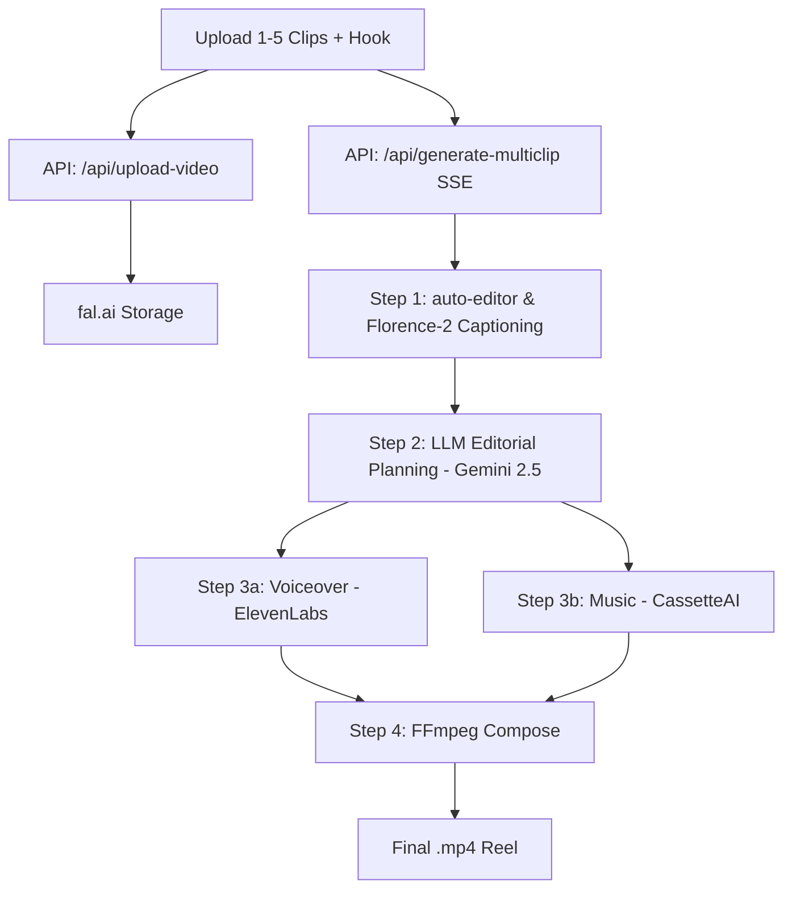

# Reel Studio — Build Walkthrough

## What Was Built

A single-page Next.js app that supports two modes:
1. **Single Photo Mode**: Takes **one photo + a hook** and produces a **finished 9:16 reel** with motion video, AI voiceover, and background music.
2. **Multi-Clip Mode**: Takes **up to 5 video clips + a hook**, auto-edits/strips silence, captions the scenes, generates an editorial edit plan via LLM (Gemini 2.5), generates voiceover and background music, and stitches/composes them sequentially.

---

## Pipeline Architecture

### Multi-Clip Mode

---

## Key Features Added & Fixed

### 1. Sequential Composition Fixes
* **Track Structure Consolidation**: Instead of using separate video tracks that caused overlap issues and `400 Bad Request` composition errors, sequential clips are compiled as sequential `keyframes` within a single `main_video` track.
* **Output Resolution**: Added explicit `width: 720` and `height: 1280` parameters to the `compose` endpoint.
* **Response Parser**: Updated the response parser to read from `data.video_url` directly, matching the compositor's schema.

### 2. Resume & Skip Pipeline Stages
* **Stage Caching**: Completed stage outputs (like generated videos, transcriptions, voiceover files, music files, and LLM edit plans) are cached in the React state.
* **Granular Skips**: When rerunning a pipeline after a stage failure, the app sends previous outputs in the request body. The API detects these and skips the corresponding API calls, completing the step instantly.
* **Dynamic Savings Dashboard**: A glassmorphic card displays skipped steps, cost savings, and duration savings before triggering the build.
* **Input-Based Invalidation**: If the user modifies any input (photo, clips, hook text, tone, or mode), the cached outputs are automatically invalidated to prevent mismatch bugs.

---

## Files Updated

| File | Purpose |
|------|---------|
| [globals.css](file:///d:/2026/reel_studio/app/globals.css) | Custom styling rules |
| [page.tsx](file:///d:/2026/reel_studio/app/page.tsx) | Pipeline tracker UI, cache states, invalidation hooks, savings display, resume checkbox |
| [generate route.ts](file:///d:/2026/reel_studio/app/api/generate/route.ts) | Skip logic for Single Photo Mode stages |
| [generate-multiclip route.ts](file:///d:/2026/reel_studio/app/api/generate-multiclip/route.ts) | Skip logic for Multi-Clip Mode stages, schema-compliant sequential composition track arrangement |

---

## Pipeline Models Used

| Stage | fal Model | Estimated Cost |
|------|-----------|----------------|
| **Image → Video** | `fal-ai/kling-video/v2.1/standard/image-to-video` | ~$0.28 / single |
| **Captioning** | `fal-ai/florence-2-large/more-detailed-caption` | ~$0.005 / clip |
| **Editorial Planning** | `google/gemini-2.5-flash` (via OpenRouter) | ~$0.002 / plan |
| **Voiceover** | `fal-ai/elevenlabs/tts/eleven-v3` | ~$0.01 / reel |
| **Background Music** | `cassetteai/music-generator` | ~$0.02 / reel |
| **Composition** | `fal-ai/ffmpeg-api/compose` | ~$0.02 / composition |

---

## Verification

* ✅ `npm run build` completed successfully without any compilation errors.
* ✅ Staged, committed, and pushed to your GitHub repository: `https://github.com/Vidharshan/reel_studio`.
