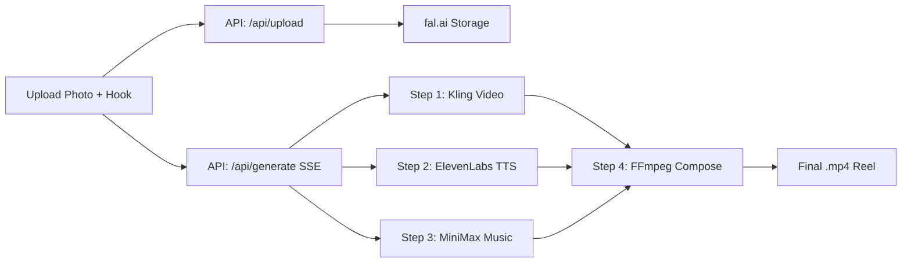

# Reel Studio — Build Walkthrough

## What Was Built

A single-page Next.js app that takes **one photo + a one-line hook** and produces a **finished 9:16 reel** with motion video, AI voiceover, background music — all powered by **4 chained fal.ai endpoints** running in parallel.

---

## Architecture

Steps 1–3 run **in parallel**. Step 4 fires once all three resolve.

---

## Files Created

| File | Purpose |
|------|---------|
| [globals.css](file:///d:/2026/reel_studio/app/globals.css) | Design system: dark theme, glassmorphism, gradients, animations |
| [layout.tsx](file:///d:/2026/reel_studio/app/layout.tsx) | Root layout with Google Fonts + SEO metadata |
| [page.tsx](file:///d:/2026/reel_studio/app/page.tsx) | Main SPA: upload zone, pipeline tracker, previews, execution trace |
| [pipeline.ts](file:///d:/2026/reel_studio/lib/pipeline.ts) | Step definitions, types, tone options, cost estimates |
| [proxy route.ts](file:///d:/2026/reel_studio/app/api/fal/proxy/route.ts) | Secure fal.ai proxy (hides FAL_KEY from client) |
| [generate route.ts](file:///d:/2026/reel_studio/app/api/generate/route.ts) | SSE pipeline orchestrator — fires parallel steps, streams events |
| [upload route.ts](file:///d:/2026/reel_studio/app/api/upload/route.ts) | Image upload → fal.ai storage URL |

---

## Pipeline Models

| Step | fal Model | Cost |
|------|-----------|------|
| 1. Image → Video | `fal-ai/kling-video/v2.1/standard/image-to-video` | ~$0.28 |
| 2. Voiceover | `fal-ai/elevenlabs/tts/eleven-v3` | ~$0.01 |
| 3. Background Music | `fal-ai/minimax-music/v2` | ~$0.03 |
| 4. Composition | `fal-ai/ffmpeg-api/merge-audio-video` | ~$0.01 |

**Total estimated cost per reel: ~$0.33**

---

## Key Features

- **Live Pipeline Tracker**: 4-node tracker showing Queued → Running (elapsed timer) → Done (latency + cost)
- **Cost Ticker**: Real-time "Cost so far: $X.XX · Time: Xs" display
- **Progressive Previews**: Blurred image overlay while video generates, animated waveforms while audio generates
- **Execution Trace**: Collapsible table showing model, input, duration, cost, status per call
- **Error Handling**: Step-level error display with graceful partial results
- **Caching**: Hash-based in-memory cache prevents duplicate API calls on re-submit
- **File Validation**: Client-side type/size check before uploading

---

## Verification

- ✅ `npm run build` — passes without errors
- ✅ UI renders correctly in browser at `http://localhost:3000`
- ✅ Dark theme, glassmorphism, gradient effects all working

## Next Steps

1. Add your `FAL_KEY` to `.env.local`
2. Run `npm run dev` and test with a real photo
3. Optionally deploy to Vercel
